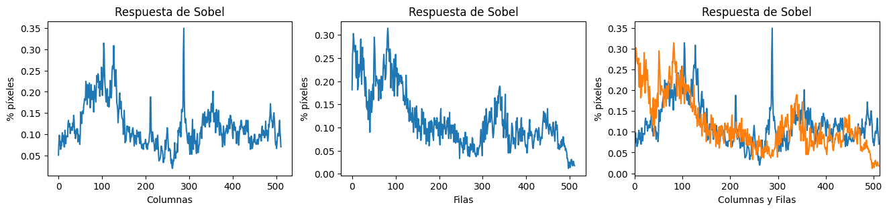

# Práctica 2. Funciones básicas de OpenCV

## Descripción
Modificación de imágenes y vídeo con OpenCV y Numpy.

## Tareas del Proyecto
- Contar píxeles blancos por filas. Determimar el valor máximo de píxeles blancos para filas (maxfil), mostrar el número de filas y sus respectivas posiciones con un número de píxeles blancos mayor o igual que 0.95*maxfil.


- Aplicación umbralizado a la imagen resultante de Sobel (convertida a 8 bits), y posteriormente realizar el conteo por filas y columnas similar al realizado en el ejemplo con la salida de Canny de píxeles no nulos. Calcula el valor máximo de la cuenta por filas y columnas, y determina las filas y columnas por encima del 0.95*máximo. Remarca con alguna primitiva gráfica dichas filas y columnas sobre la imagen. ¿Cómo se comparan los resultados obtenidos a partir de Sobel y Canny?




- Se propuso un demostrador que capture las imágenes de la cámara, y les permita exhibir lo aprendido. Es por ello que además de poder mostrar la imagen original de la webcam, incluya al menos dos usos diferentes de aplicar las funciones de OpenCV trabajadas hasta ahora.
- Nuestra propuesta: Al pulsar *Enter* se cambiará a diferentes modos: normal, detección de verdes, filtro sepia, umbralizado sobel.
  


- Tras ver los vídeos [My little piece of privacy](https://www.niklasroy.com/project/88/my-little-piece-of-privacy), [Messa di voce](https://youtu.be/GfoqiyB1ndE?feature=shared) y [Virtual air guitar](https://youtu.be/FIAmyoEpV5c?feature=shared) proponer un demostrador reinterpretando la parte de procesamiento de la imagen, tomando como punto de partida alguna de dichas instalaciones.
- Nuestra propuesta: El objeto rojo vistoso más grande detectado se podrá usar de pincel, el objeto verde vistoso más grande detectado se podrá usar como borrador.
  


## Requisitos
### [Anaconda Prompt](https://www.anaconda.com/)
```
conda create --name VC_P2 python=3.11.5
conda activate VC_P2
```
### OpenCV
```
pip install opencv-python
```
### Matplotlib
```
pip install matplotlib
```
### NumPy
```
pip install numpy
```
### ipykernel
```
conda install -n VC_P2 ipykernel --update-deps --force-reinstall
```

## Bibliografía
[Detección de colores en OpenCV – Python (En 4 pasos)](https://omes-va.com/deteccion-de-colores/)

[DETECCIÓN DE COLORES Y Tracking en OpenCV – Parte2](https://omes-va.com/deteccion-de-colores2//)

[Marcador o Lápiz virtual | OpenCV – Python](https://omes-va.com/marcador-o-lapiz-virtual-opencv-python/)

[Documentación OpenCV](https://docs.opencv.org/4.x/)

[Image Processing in Java – Colored Image to Sepia Image Conversion | Pratik Agarwal](https://www.geeksforgeeks.org/image-processing-in-java-colored-image-to-sepia-image-conversion/)


## Autoría
[Sara Expósito Suárez](https://github.com/SaraE5)

[Alejandro Padrón Ossorio](https://github.com/apadoss)
